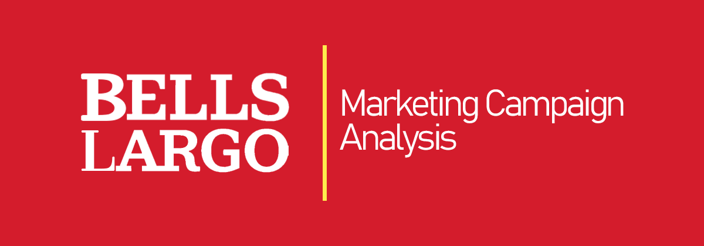
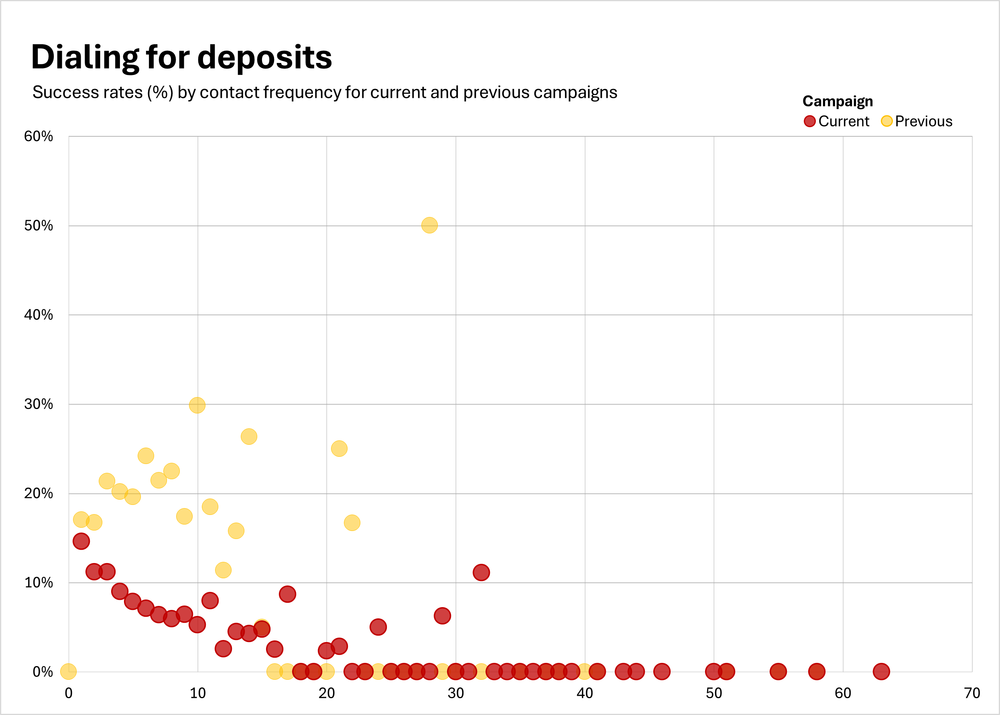
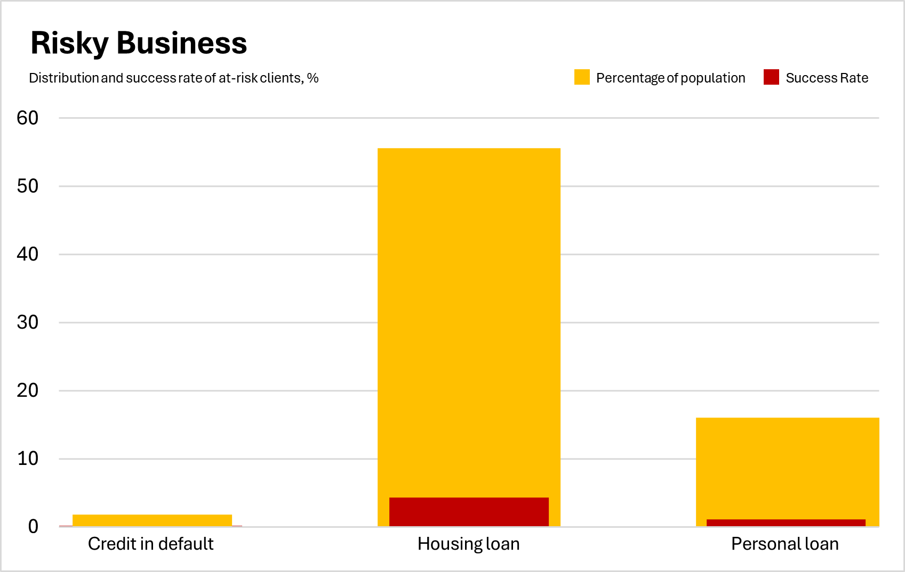
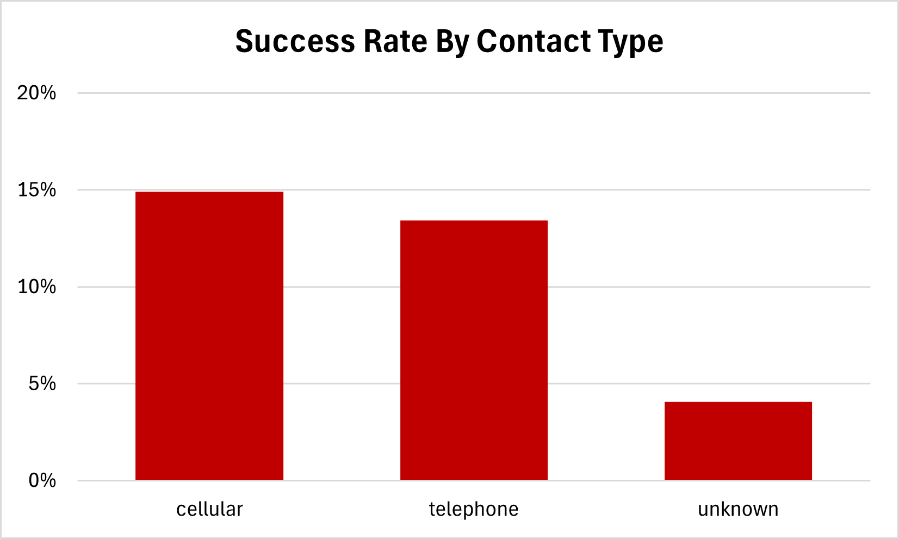
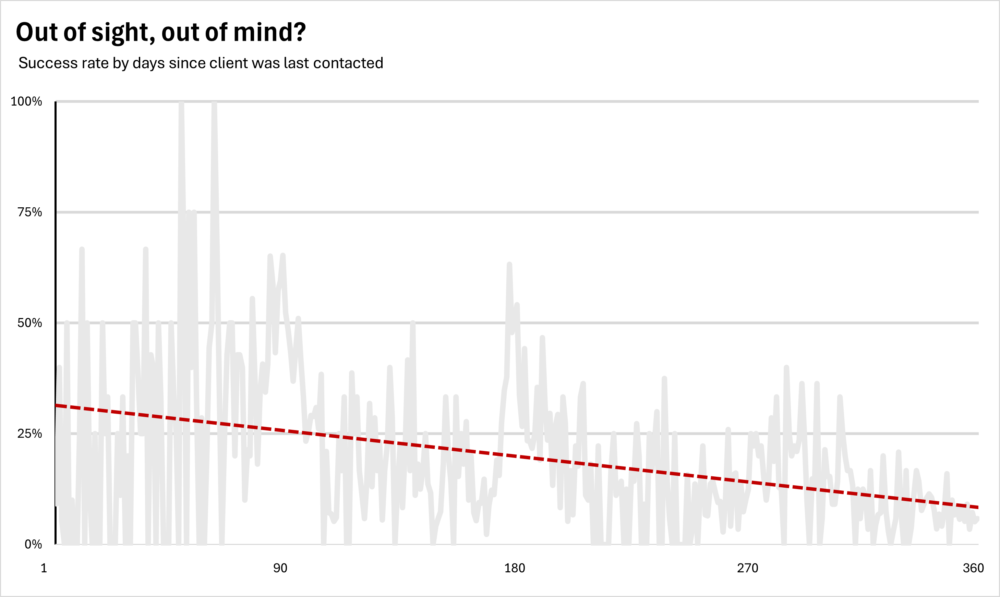
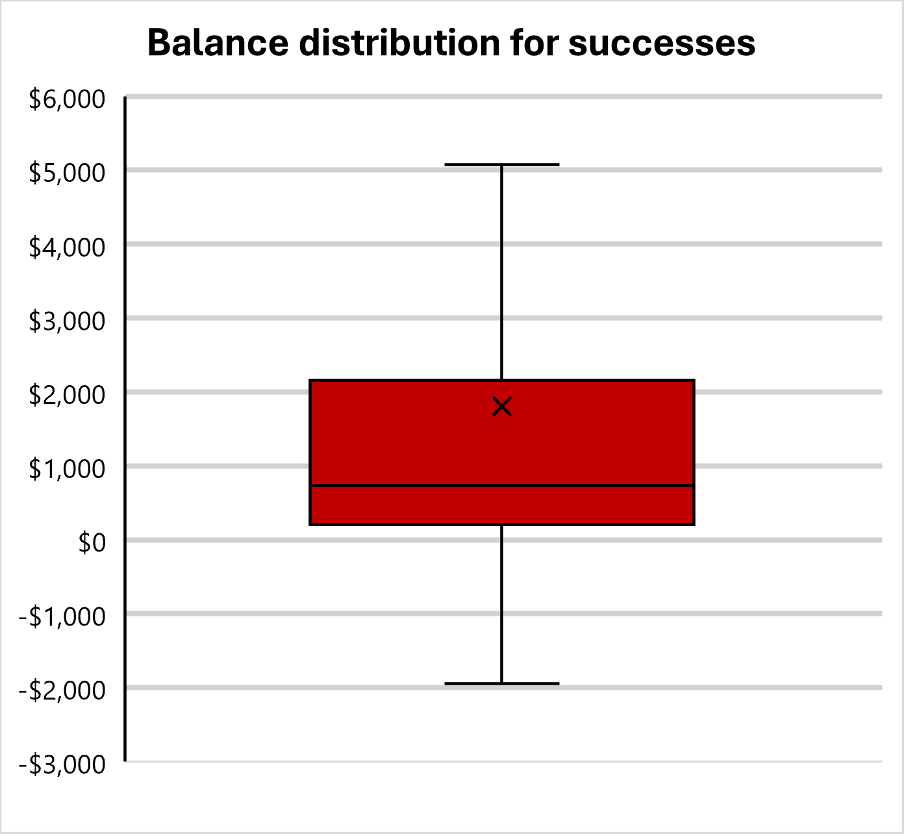

## Table of Contents
- [Background and Overview](#background-and-overview)
- [Data Structure Overview](#data-structure-overview)
- [Executive Summary](#executive-summary)
- [Insights Deep Dive](#insights-deep-dive)
- [Recommendations](#recommendations)

## Background and Overview
Bells Largo is a fictional multinational bank offering a wide range of financial services, including personal banking, loans, and investment products. With a large client base spanning the U.S., Bells Largo is constantly seeking ways to enhance the effectiveness of its marketing strategies to drive client engagement and growth.

This analysis focuses on the performance of two marketing campaigns aimed at increasing term deposit subscriptions. Key areas of investigation include campaign success rates, the impact of contact frequency and recency on client engagement, and identifying client segments most likely to respond positively to future campaigns.
How can Bells Largo have a greater effectiveness for future marketing campaigns?

Insights and recommendations are provided on the following key areas:
- **Contact Frequency**: Analysis of how the number of times clients were contacted affected campaign success.
- **Client Risk Levels**: Examination of engagement rates among clients with varying financial risk.
- **Contact Type**: Evaluation of success rates by communication method (cellular vs telephone).
- **Recency of Contact**: Impact of the time since last contact on client engagement.
- **Client Balance**: Relationship between clients' average yearly balance and campaign success.

## Data Structure Overview
The analysis was conducted using the [UC Irvine Machine Learning Repository Bank Marketing Dataset](https://archive.ics.uci.edu/dataset/222/bank+marketing). This dataset contains information about clients of a bank and their responses to previous marketing campaigns, offering detailed insights into factors that influence term deposit subscriptions.

View the table column details [here](sql_load/2_create_table.sql)

## Executive Summary
### Summary of Findings
The overall success rate for Bells Largo's current marketing campaign stands at **11.70%**, an improvement of 250% over the previous campaign's 3.34% success rate. Key findings reveal that clients with higher average yearly balances and those contacted within 90 days of a prior interaction are more likely to subscribe to term deposits. Additionally, clients with lower financial risk, such as those with housing loans, respond more favorably to the campaign. Optimizing contact frequency and targeting high-balance, low-risk clients can further improve the effectiveness of future campaigns.

## Insights Deep Dive
### Contact Frequency

*Figure 1*
- Clients contacted between 1 and 10 times had a success rate ranging from 5.26% to 14.60%. **The highest success rate was observed for clients contacted just once, at 14.60%**, while clients contacted 10 times had a success rate of 5.26%. 
- **Beyond 10 contacts, the success rate did not significantly increase and often diminished,** with clients contacted more than 20 times experiencing a success rate of less than 5%.

### Client Risk Levels

*Figure 2*
- **Clients with housing loans were 4 times more likely to subscribe compared to those with credit in default.** Clients with housing loans had a success rate of 4.28%, which is approximately 3.98 times higher than clients with credit in default, who had a success rate of 0.12%. 
- Clients with housing loans represent 55.58% of the population and showed a significantly higher likelihood of subscribing to a term deposit compared to those with credit in default, who make up only 1.80% of the population.
- Clients with personal loans had a success rate of 1.07%, which is also higher than those with credit in default but lower than clients with housing loans.
- The data shows that clients considered lower-risk (e.g., those with housing loans) had a significantly higher likelihood of subscribing to a term deposit. Clients with credit in default were much less responsive to the campaign, with substantially lower engagement and subscription rates.

### Contact Type

*Figure 3*   
- **Cellular contact led to an 11.20% higher success rate than telephone contact.** Clients contacted via cellular had a success rate of 14.92%, compared to 13.42% for telephone contact. 
- This 11.20% higher success rate indicates that mobile communication may be slightly more effective in engaging clients.

### Recency of Contact

*Figure 4*   
- **Clients contacted within 90 days had a success rate up to 65.31%, compared to just 27.27% for those contacted after 90 days.** Specifically, the success rate for clients contacted within the first 30 days ranged from 40.00% to 65.31%, while for those contacted beyond 90 days, the success rate dropped to a range between 5.88% and 27.27%. 
- This substantial difference highlights the critical impact of timely contact on the likelihood of a successful subscription.

### Client Balance
 *Figure 5*

*Figure 6*   
- **Clients with average yearly balances in the top 25% were approximately 3.5 times more likely to subscribe than those in the bottom 25%.** The median balance for successful clients was 733, compared to 417 for unsuccessful clients. These findings suggest that clients with higher average balances are significantly more responsive to the campaign and should be prioritized in future marketing efforts.

## Recommendations
1. **Optimize Contact Frequency**: Focus efforts on contacting clients within the first 20 attempts, as diminishing returns are evident beyond that point. Streamlining follow-ups to avoid over-contacting will reduce resource expenditure without significantly impacting results.

2. **Leverage Recency in Follow-Up**: Clients are more likely to respond favorably within 90 days of previous contact. Design campaigns with shorter follow-up cycles to maintain client engagement and increase conversion rates.

3. **Increase Focus on High-Balance Clients**: Given the stronger success rates among clients with higher average yearly balances, allocate more targeted marketing to this demographic, which is likely to be more receptive to term deposit offers.

4. **Target Low-Risk Client Segments**: Prioritize marketing efforts on clients with lower financial risk, such as those with housing loans, as they are more likely to engage with term deposit offers. Minimizing focus on high-risk clients, such as those with credit in default, will improve overall campaign efficiency and ROI.
