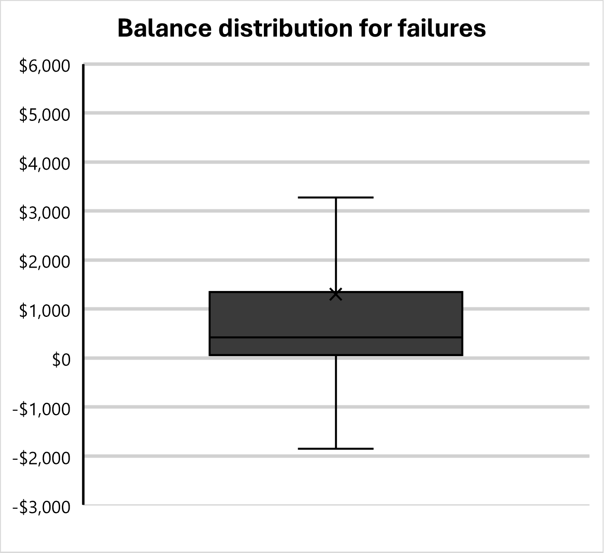

## Table of Contents
- [Business Question](#business-question)
- [Data Source](#data-source)
- [Tools Used](#tools-used)
- [Analysis & Insights](#analysis-&-insights)
- [Recommendations](#Recommendations)

## Business Question
How can Bells Largo have a greater effectiveness for future marketing campaigns?

## Data source
[UC Irvine Machine Learning Repository Bank Marketing Dataset](https://archive.ics.uci.edu/dataset/222/bank+marketing)

## Tools Used
- **SQL** 
- **MS Excel**
- **PostgreSQL** 
- **Visual Studio Code** 
- **Git & Github** 

## Analysis & Insights
1. **How does the success rate of the previous campaign compare to the current campaign?**   
During the previous campaign, 1,511 out of 45,211 clients subscribed to a term deposit, a **3.34%** success rate. The current campaign saw a 250% increase in subscriptions resulting in a success rate of  **11.70%**.

2. **How did the number of times clients were contacted impact the success rate?**   

*Figure 1*

In both campaigns, there did not appear to be a strong positive correlation between the number of times clients were contacted and success rate. As depicted in *Figure 1*, both campaigns saw the most success within 20 calls. With the exception of a few outliers*, any more than 25 calls did not lead to any subscriptions. 

*The instance from the previous campaign with a 50% success rate was due to 1 of 2 clients that was contacted 28 times subscribed to a term deposit.

3. **How did at-risk clients respond to the marketing campaign?**

*Figure 2*
The data shows a clear trend: the higher the financial risk posed by the client (i.e., credit in default), the lower their engagement with the campaign. Conversely, clients with lower perceived risk (e.g., housing loans) were more likely to subscribe to term deposits.

4. **What was the success rate by contact type?**

*Figure 3*   
There was not a large difference between the success rate of cellular vs telephone contacts. 14.92% vs 13.42%, respectively.

5. **How did the length of time since previous contact impact success rate?**

*Figure 4*   
The trendline in *Figure 4* reflects an inverse correlation between success rate and days passed. Highest success appears to be found when clients are contacted within 90 days. (Note: the graph only depicts data up to one year)

6. **Is there connections between clients' average yearly balance and success?**

*Figures 5 & 6*
The marketing campaign appeared to produce more success with clients that had higher average yearly balances. 

## Recommendations
1. **Optimize Contact Frequency**: Focus efforts on contacting clients within the first 20 attempts, as diminishing returns are evident beyond that point. Streamlining follow-ups to avoid over-contacting will reduce resource expenditure without significantly impacting results.

2. **Leverage Recency in Follow-Up**: Clients are more likely to respond favorably within 90 days of previous contact. Design campaigns with shorter follow-up cycles to maintain client engagement and increase conversion rates.

3. **Increase Focus on High-Balance Clients**: Given the stronger success rates among clients with higher average yearly balances, allocate more targeted marketing to this demographic, which is likely to be more receptive to term deposit offers.

4. **Target Low-Risk Client Segments**: Prioritize marketing efforts on clients with lower financial risk, such as those with housing loans, as they are more likely to engage with term deposit offers. Minimizing focus on high-risk clients, such as those with credit in default, will improve overall campaign efficiency and ROI.
